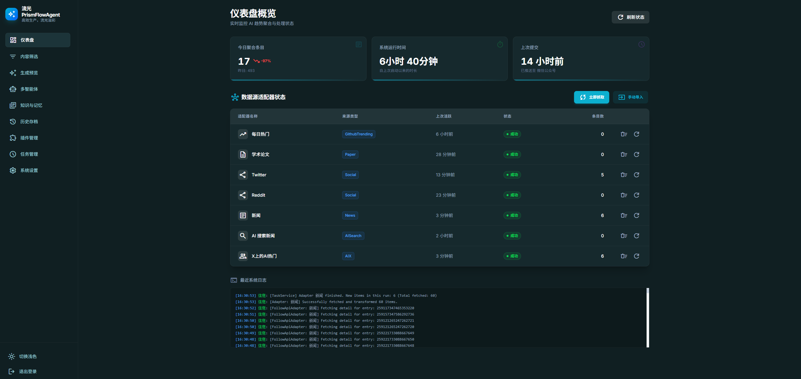

# 流光 PrismFlowAgent 🌈

> **自动化信息聚合 + AI 智能体：让高质量信息自动流向你**

流光 (PrismFlowAgent) 是一个全栈自动化资讯处理系统。它能帮你从 GitHub、RSS、社交媒体抓取海量信息，利用最强的 AI (Gemini/Claude/GPT) 进行深度总结，并自动分发到你的微信公众号、GitHub 仓库或 RSS 订阅源。

---

## 🌟 核心亮点 (Core Highlights)

流光 (PrismFlowAgent) 的核心竞争力在于其**极高可靠性的全链路自动化**：

### 1. 深度信息聚合 (Smart Ingest)
- **多源监控**: 实时监控 GitHub Trending、学术论文、Twitter/Reddit 等动态。
- **极速扩展**: 插件化架构，几分钟即可接入任何新的网页或 API 数据源。

### 2. 流程高度稳定 (Stable Workflow)
- **健壮调度**: 从抓取、处理到存储（SQLite/本地缓存），任务调度逻辑严密，支持 24 小时无人值守监控。
- **自动化流转**: 确保信息从源头到分发的每一个环节都稳定可靠。

### 3. 生成内容稳定 (Stable AI Content)
- **全模型适配**: 原生支持 Gemini, Claude, GPT 和本地部署的 Ollama。
- **结构化输出**: 通过预设 Prompt 模板确保语义统一、格式标准，输出高质量深度总结。

### 4. 一键/自动发布 (Stable Distribution)
- **多端触达**: 一键（或全自动）推送到**微信公众号**、存入 **GitHub** 归档，或生成标准 **RSS**。
- **媒体优化**: 自动压缩图片 (AVIF) 和处理视频 (FFmpeg)，在保证画质的同时节省存储空间。

### 5. AI 交互与互操作 (Agent Interop)
- **专为 AI 设计**: 提供 API 与接入指引，让外部 AI Agent 能像操作四肢一样调用本地工具，Agent，工作流。
- **闭环协作**: 支持 AI 自动触发抓取、筛选与发布流程，实现真正的人机协作。

---

## 🤝 人机协作：你定规则，它干活

我们坚持 **“人脑决策，AI 执行”** 的原则：
- **你负责**：挑选数据源、设定 Prompt 模板、审核发布内容。
- **AI 负责**：24小时不间断盯盘、海量内容阅读总结、自动排版、资源上传。

---

## 🤖 AI 接入示例 (Agent Interop)

如果你有外部 AI Agent（如 Claude Desktop 或其他自主 Agent），可以直接让它接管本系统。

**发送给 Agent 的指令示例：**
> “请阅读 `https://raw.githubusercontent.com/justlovemaki/PrismFlowAgent/main/AI_INTEROP.md` 接入指引，按照流程完成自助注册并接入我的系统, 地址：http://localhost:3000 。”

---

## 📖 分步使用指南



### 1. 登录系统
访问 `http://localhost:5173/login`，输入默认密码 `admin123`。

### 2. 配置 AI 与插件
前往 **设置 (Settings)** 页面：
- **AI 配置**：填写你的 Gemini 或 OpenAI API Key。
- **插件配置**：配置 GitHub Token 或微信公众号凭据。

### 3. 运行抓取
在 **任务管理 (Task Management)** 页面，点击任务旁的 **立即运行**（如 GitHub Trending），系统将自动拉取最新资讯。

### 4. 筛选与排序
前往 **内容筛选 (Selection)** 页面，勾选你感兴趣的条目，支持拖拽调整顺序。

### 5. AI 生成
点击下方的 **生成 AI 内容**：
- 确认素材，选择合适的 **智能体 (Agent)** 或 **工作流 (Workflow)**。
- 点击生成，AI 将输出深度精简后的结构化内容。

### 6. 发布
生成完成后，一键点击 **发布到 GitHub** 或 **发布到微信** 即可完成全自动分发。

---

## 🛠️ 技术底座

| 模块 | 关键技术 |
| :--- | :--- |
| **后端** | Node.js 20+ (ESM), Fastify, TypeScript 5 |
| **前端** | React 19, Vite, Tailwind CSS, Framer Motion |
| **数据库** | SQLite (轻量可靠，无需复杂配置) |
| **存储** | Cloudflare R2 / GitHub / 本地存储 |

---

## 📂 核心目录结构

```text
├── src/
│   ├── api/            # Fastify 路由与接口
│   ├── plugins/        # 核心插件 (适配器、工具、分发器)
│   ├── registries/     # 插件注册中心 (支持热启停)
│   ├── services/       # 业务逻辑 (AI、任务调度、工作流)
│   └── types/          # 全局 TypeScript 定义
├── frontend/           # 管理后台 (React SPA)
└── data/               # 本地数据库与缓存
```

---

## ⚡ 快速开始

### 1. 安装环境
确保你本地有 **Node.js 20+** 和 **pnpm**。

```bash
git clone https://github.com/justlovemaki/PrismFlowAgent.git
cd PrismFlowAgent

# 安装依赖
npm install
cd frontend && pnpm install && cd ..
```

### 2. 本地启动
```bash
# 全栈开发模式 (后端 + 前端一起启动)
npm run dev:all

# 访问: http://localhost:5173
# 默认密码: admin123
```

---

## 📖 相关文档
- 🛠️ [AGENTS.md](./AGENTS.md) - 规范、开发准则与最佳实践。
- 🔌 [PLUGINS.md](./PLUGINS.md) - 如何编写自己的适配器与分发器。
- 🛰️ [AI_INTEROP.md](./AI_INTEROP.md) - **AI 接入必读**: 让你的 Agent 开启上帝视角。

---

## 📜 许可证
基于 [GPL-3.0 License](./LICENSE) 授权。
